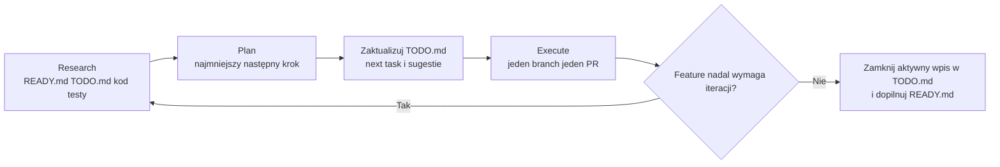
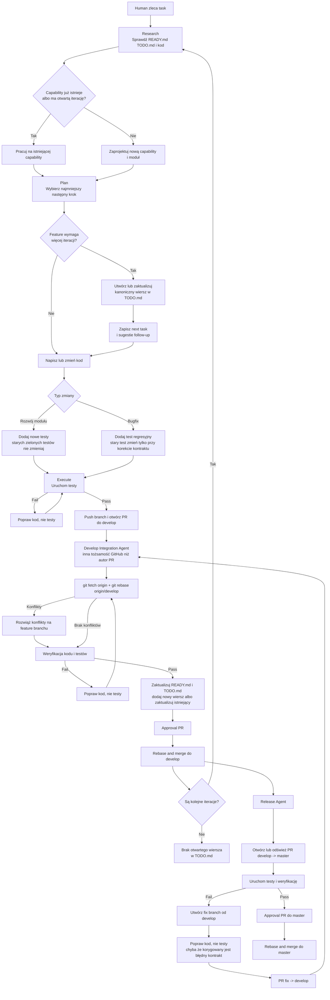
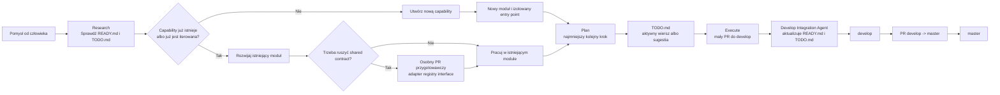

# Graf flow dla agentów

## Role

- `Feature Agent` tworzy kod na branchu `feature/...` i otwiera PR do `develop`
- `Develop Integration Agent` bierze każdy PR do `develop`, robi rebase, rozwiązuje konflikty, weryfikuje kod i przygotowuje merge
- `Release Agent` pilnuje przepływu `develop -> master`
- `Human` nie pisze kodu ręcznie; definiuje zadania i nadzoruje wynik

## Pętla `Research -> Plan -> Execute`

## Główny flow

## Twarde zasady

- przed rozpoczęciem taska agent sprawdza `READY.md` i `TODO.md`
- jedna capability ma jeden kanoniczny wpis w `READY.md`
- jedna capability ma najwyżej jeden otwarty wiersz w `TODO.md`
- `READY.md` opisuje capability już zmergowane do `develop`, a nie pomysły lub backlog
- `TODO.md` opisuje aktywne iteracje i sugestie, a nie gotowe capability
- żeby zmniejszyć konflikty, `READY.md` aktualizuje tylko `Develop Integration Agent`
- `Feature Agent` aktualizuje tylko własny wiersz w `TODO.md`; `Develop Integration Agent` go zamyka albo normalizuje przy merge
- pracujemy iteracyjnie w pętli `Research -> Plan -> Execute`
- testy są święte; jeśli pipeline jest czerwony, agent poprawia kod
- agent nie zmienia testów tylko po to, żeby pipeline zrobił się zielony
- przy rozwoju modułu stare zielone testy zostają bez zmian
- przy bugfixie agent dodaje test regresyjny; istniejący test zmienia tylko przy korekcie kontraktu
- jeśli pojawia się osobna, sensowna capability, wpisujemy ją do sugestii w `TODO.md`
- approval PR musi zrobić inna tożsamość GitHub niż autor PR
- `master` i `develop` są tylko do PR-ów i tylko do `Rebase and merge`
- nie używamy `Update branch`; zawsze robimy rebase na `origin/develop`

## Flow przy bardzo dużej skali

## Zasady skalowania

- każdy feature powinien trafiać głównie do własnego modułu
- najpierw sprawdzamy `READY.md` i `TODO.md`, żeby nie budować drugi raz tego samego capability pod inną nazwą
- wspólne kontrakty i typy powinny być wydzielone z logiki feature'ów
- jeśli kilka feature'ów dotyka tego samego pliku, to znak, że trzeba wydzielić adapter albo registry
- duże refaktory i zmiany kontraktów robi się osobno, nie razem z featurem
- nowe capability dopisujemy do `READY.md`, a rozwój lub bugfix aktualizuje istniejący wpis
- długi feature nie zakłada nowego duplikatu; utrzymuje jeden aktywny wiersz w `TODO.md` i iteruje po jednym kroku
- odrębne, pasujące follow-upy zapisujemy jako sugestie w `TODO.md`, a nie jako równoległe duplikaty
- przy dużym ruchu warto włączyć `Merge Queue` na `develop`
